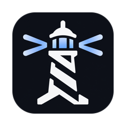
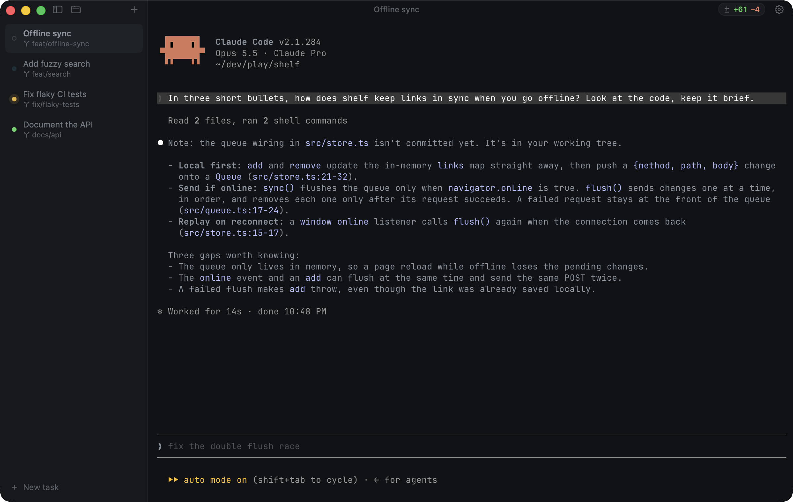
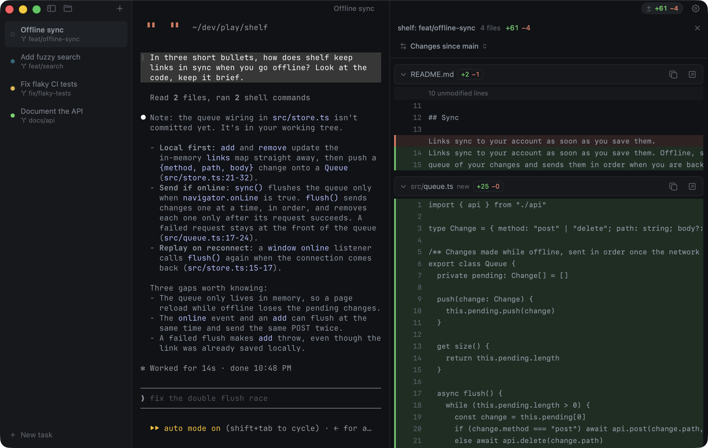

<p align="center">
  
</p>

<h1 align="center">Farol</h1>

<p align="center">A fast macOS terminal for working with coding agents.</p>

<p align="center">
    <a href="https://github.com/snowztech/farol/releases/latest"></a>
    <a href="https://github.com/snowztech/farol/stargazers"></a>
    <a href="https://github.com/snowztech/farol/network/members"></a>
    <a href="https://github.com/snowztech/farol/issues"></a>
    <a href="LICENSE"></a>
</p>

<p align="center"></p>

Run several coding agents side by side, each in its own session, and Farol shows you which one is working, which one is done and which one needs you. Farol is Portuguese for lighthouse.

Underneath is [libghostty](https://github.com/ghostty-org/ghostty), the engine behind Ghostty, so it is as fast as Ghostty and reads your Ghostty config.

Farol is early. It works as a daily terminal, but expect rough edges.

## Install

1. Download [Farol.dmg](https://github.com/snowztech/farol/releases/latest/download/Farol.dmg), the latest release.
2. Open it and drag Farol to Applications.
3. Open Farol from Applications or Spotlight.

It needs a Mac with Apple Silicon and macOS 14 or later. Releases are signed and notarized, so macOS opens Farol without warnings. To build from source instead, see [Build from source](#build-from-source).

## Features

- **New task.** ⇧⌘N asks what to do, then starts Claude Code or Codex on it in a new worktree, with the task as its first prompt.
- **Agent status.** Each session shows whether its agent is working, waiting for you or done, with a notification when it waits in the background. See [Agent status](#agent-status).
- **Worktree sessions.** ⇧⌘T asks for a branch and opens a session in its own git worktree, so parallel agents never touch each other's files. Closing it offers to remove the worktree and always keeps the branch.
- **Sessions in a sidebar.** Open as many as you like. Hidden sessions keep running but stop rendering, so twenty background agents cost no GPU time. Each row shows its git branch, and Settings → Appearance can group sessions under each project's name. Double-click to rename, drag to reorder.
- **Files next to the terminal.** ⇧⌘E opens the session's project as a tree, with ignored files dimmed. Click a file to open it in a pane beside the terminal, with line numbers and ⌘F, and make a quick fix with ⌘S to save. When an agent changes the file you have open, it reloads, or asks first if you have unsaved edits. The tree updates as agents add files, and costs nothing while it is closed.
- **Review what the agent did.** The title bar shows what the session changed, like `± +821 −61`, and only while there is something to see. Click it, or ⌥⌘R, for every changed file as one scrolling diff, uncommitted work or everything since the branch left main or any other branch. Open a file from there to land on its first change and fix it.
- **Split panes.** ⌘D splits a session, and the new pane opens in the same folder. ⇧⌘R gives a pane a name, like "back" or "tunnel". Layouts and names come back after a relaunch.
- **Find in scrollback.** ⌘F searches the focused pane and shows the match count.
- **Ghostty inside.** Same rendering, speed and escape sequence support, and your Ghostty config is loaded.
- **Themes and settings.** Ghostty's 600+ themes with live previews, and settings inside the window.
- **Copy and paste, accents and input methods.** Pasting text that could run commands asks first, dead keys compose as you type, and input methods for other languages work at the cursor.

Coming next: a review view for what an agent did, and GitLab, GitHub and Jira integrations. See [ROADMAP.md](ROADMAP.md).

<p align="center"></p>

## Agent status

The dot next to each session shows what its agent is doing:

- **Idle:** a hollow gray dot.
- **Working:** a cyan dot that breathes.
- **Waiting for you:** a yellow dot that sends out a ripple, for a permission prompt or a question.
- **Done:** a green dot, back to hollow when you open the session.

The colors come from your theme's own cyan, yellow and green, so they always match it.

When an agent waits or finishes while Farol is in the background, you get a notification, and the Dock icon counts the sessions that are waiting.

**Claude Code:** open Settings → Agents and click **Enable**. Farol adds its hooks to `~/.claude/settings.json`, leaves everything else in the file alone and keeps a backup. **Turn off** removes only Farol's hooks.

**Codex:** same place, click **Enable**. Farol turns on Codex's terminal notifications in `~/.codex/config.toml`, so you hear from Codex when it needs your approval or finishes a turn. The sidebar shows a yellow dot until you open the session. Codex can't report while it works, so there is no working dot. Farol marks the lines it adds and **Turn off** removes only those.

**Other agents** can report with `"$FAROL_CLI" status working|waiting|done|clear`, which Farol makes available in every session. Agents that ring the terminal bell show as waiting without any setup.

<details>
<summary>The Claude Code hooks, if you prefer to add them by hand</summary>

```json
{
  "hooks": {
    "UserPromptSubmit": [{ "hooks": [{ "type": "command", "command": "[ -z \"$FAROL_CLI\" ] || \"$FAROL_CLI\" status working" }] }],
    "PostToolUse": [{ "hooks": [{ "type": "command", "command": "[ -z \"$FAROL_CLI\" ] || \"$FAROL_CLI\" status working" }] }],
    "Notification": [{ "matcher": "permission_prompt|elicitation_dialog", "hooks": [{ "type": "command", "command": "[ -z \"$FAROL_CLI\" ] || \"$FAROL_CLI\" status waiting" }] }],
    "Stop": [{ "hooks": [{ "type": "command", "command": "[ -z \"$FAROL_CLI\" ] || \"$FAROL_CLI\" status done" }] }],
    "SessionEnd": [{ "hooks": [{ "type": "command", "command": "[ -z \"$FAROL_CLI\" ] || \"$FAROL_CLI\" status clear" }] }]
  }
}
```

Outside Farol `$FAROL_CLI` is unset, so the hooks do nothing. The Notification matcher leaves out Claude's idle reminder, which would otherwise mark a finished session as waiting.

</details>

<details>
<summary>The Codex settings, if you prefer to add them by hand</summary>

In `~/.codex/config.toml`:

```toml
[tui]
notifications = true
notification_method = "osc9"
notification_condition = "always"
```

Farol ignores notifications from the session you are looking at, so "always" doesn't make it noisy.

</details>

## Shortcuts

| Action | Keys |
| --- | --- |
| New task | ⇧⌘N |
| New session | ⌘T or ⌘N |
| New worktree session | ⇧⌘T |
| Close pane or session | ⌘W |
| Next or previous session | ⇧⌘] and ⇧⌘[ |
| Go to session 1 to 9 | ⌘1 to ⌘9 |
| Split right or down | ⌘D and ⇧⌘D |
| Move between panes | ⌘[ and ⌘], or ⌘⌥ with arrows |
| Resize the focused pane | ⌘⌃ with arrows |
| Equal pane sizes | ⌘⌃= |
| Zoom the focused pane | ⇧⌘↩ |
| Name the focused pane | ⇧⌘R |
| Find, next, previous | ⌘F, ⌘G, ⇧⌘G |
| Find the selected text | ⌘E |
| Toggle sidebar | ⌘B |
| Toggle files | ⇧⌘E |
| Save the open file | ⌘S |
| Review changes | ⌥⌘R |
| Full screen | ⌃⌘F |
| Settings | ⌘, |
| Reload configuration | ⇧⌘, |

Closing the last session quits Farol. Closing a session or quitting asks first when a program is still running. Ghostty's other default shortcuts, such as ⌘K to clear and ⌘+ to zoom, work as in Ghostty.

## Configuration

Use the settings page (⌘,) or edit `~/.config/farol/config` directly. They are the same thing: the page writes to that file, and saving the file updates the page and every session right away. Settings → Terminal has a button that opens it.

```
theme = Catppuccin Mocha
font-family = JetBrains Mono
font-size = 14
```

The file uses Ghostty's format, so every option in the [Ghostty docs](https://ghostty.org/docs/config) works. If you also use Ghostty, your Ghostty config loads first and Farol's file wins.

### Custom themes

Drop a theme file in `~/.config/farol/themes` and it shows up first in Settings → Appearance. Settings has a **Themes folder** button that opens it. A theme file is a few lines of Ghostty config:

```
background = #1e1e2e
foreground = #cdd6f4
cursor-color = #f5e0dc
palette = 0=#45475a
palette = 1=#f38ba8
```

## Build from source

You need macOS 14 or later and Xcode 26.

```sh
make install   # builds Farol into /Applications
```

The first build downloads a prebuilt libghostty for the pinned Ghostty commit. After that, `make run` gives you a quick debug build and `make help` lists everything else. Farol Dev, the `make run` build, is signed only locally, so macOS doesn't show its notifications. Status dots and the Dock badge still work.

To compile libghostty yourself, install Zig 0.16 and the Metal toolchain (`xcodebuild -downloadComponent MetalToolchain`), then run `FROM_SOURCE=1 ./scripts/build-ghostty.sh`.

## How it's built

```
Sources/
  GhosttyTerminal/   the only code that touches Ghostty's C API
  FarolCore/         git and worktree logic, no UI, tested
  Farol/             the app: sessions, sidebar, window, settings
Tests/               FarolCore tests, run with `make test`
scripts/
  build-ghostty.sh   fetches or builds libghostty for a pinned commit
  bundle.sh          assembles build/Farol.app
  make-icon.swift    builds the app icons from assets/icons/source
  check-style.py     keeps comments and docs plain
```

Farol embeds Ghostty through its internal API (`ghostty.h`). Ghostty makes no stability promise for it, so the commit is pinned in `scripts/build-ghostty.sh`. Keeping every call in `GhosttyTerminal` means an upgrade only touches that folder.

## Contributing

Issues and pull requests are welcome. Before you open a PR, run the tests and the style check:

```sh
make test
make check
```

`make check` flags em dashes, semicolons in prose, comment blocks over three lines and filler words. Comments should explain why, not what. CI runs the same check on every pull request.

## License

MIT. Farol includes libghostty, which is also MIT licensed. See `THIRD_PARTY_NOTICES`.
